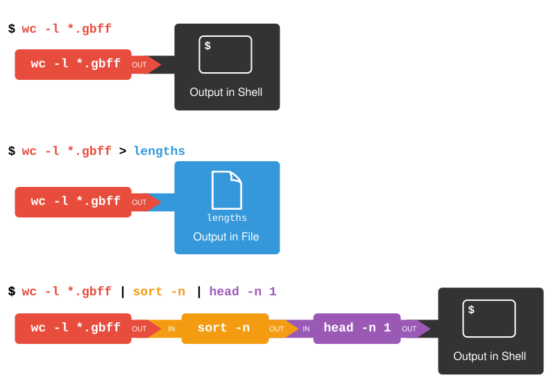

# Compute setup

### AWS and Unix Intro

#### Connecting and Properly Using a Cloud Computring Cluster at the CBW

##### Schedule

|       |                                Day 1                                |
|-------|:-------------------------------------------------------------------:|
| 10:00 |                    Welcome Introduction (Rachade)                   |
| 10:10 |                 Module 0 : AWS EC2 instance (Zhibin)                |
| 10:40 | Module 1: Logging into AWS (group split into Windows and Mac/Linux) |
| 11:10 |                                Break                                |
| 11:15 |       Module 2: Introduction to the UNIX Command Line (Hector)      |
| 11:35 |                     Module 3: File Manipulation                     |
| 12:05 |                                Break                                |
| 13:05 |         Module 4: Searching and Sorting Through Files (Rob)         |
| 14:00 |                                Break                                |
| 14:05 |                    Module 5: Shell scripts (Rob)                    |
| 15:00 |                                                                     |

##### 1. Logging into AWS

Description of the lab:

This section will show students how to login to AWS and create an instance

<iframe src="https://drive.google.com/file/d/1Vf1uiJPpY8025pJjsWNFvgK-ImqkGmVE/preview" width="640" height="480" allow="autoplay"></iframe>

Once you have confirmed your account as per the email (subject line “You have been invited to join an AWS Educate Classroom”), you can log in here:

[www.awseducate.com](www.awseducate.com)

##### 2. Introduction to the Command Line

Description of the lab:

This section will show students the basics of the command line, with a focus on navigation.

<iframe src="https://drive.google.com/file/d/1gTOzpP_VUjR7vIPidLWABps9jh5mYvA0/preview" width="640" height="480" allow="autoplay"></iframe>

###### Exercise: Exploring the filesystem

1. Connect to your AWS instance
2. Type the `ls` command, what do you see?
  
:::: {.callout title="Solution (click here)" type="gray" style="subtle" icon="true" collapsible="true"}

The `ls` command lists the contents of a working directory.

::::

3. After following the tutorial, can you answer what these commands (`cd`, `pwd`) do?

:::: {.callout title="Solution (click here)" type="gray" style="subtle" icon="true" collapsible="true"}

The `cd` command is used to *change directories*. Without arguments, it will move to the home directory (`~`) The `pwd` command shows the absolute *path to the working directory*.

::::

##### 3. File Manipulation

Description of the lab:

This section will show students how to manipulate files, including reading, editing, and renamming text files.

<iframe src="https://drive.google.com/file/d/1gYHurIPaOlmxZMtVXDqjDW8L-jZfFzr6/preview" width="640" height="480" allow="autoplay"></iframe>

Additional material:

Here are two cheat-sheets that can be usedful to have as a reference for common UNIX/Linux commands:

- [FOSSwire.com Unix/Linux Command Reference](https://files.fosswire.com/2007/08/fwunixref.pdf)
- [SUSO.org Unix/Linux Command Syntax and Reference](https://www.reddit.com/media?url=https%3A%2F%2Fi.redd.it%2F6s2q64ticje51.png)

###### Excercise: Reading Text Files

1. What do the commands `cat`, `head`, and `tail` do? What do they have in common?

:::: {.callout title="Solution (click here)" type="gray" style="subtle" icon="true" collapsible="true"}

All three of these commands ouptut the contents of a text file to *standard out*: - `cat` outputs the *full* contents of the file - `head` outputs the *first* 10 lines of a file - `tail` outputs the *last* 10 lines of a file

::::

2. What does the command `less` do? How is it different from `cat`?
  
:::: {.callout title="Solution (click here)" type="gray" style="subtle" icon="true" collapsible="true"}

`less` opens a text file for viewing. Unlike `cat`, it will display it in a separate file viewer.

::::

3. How can you know the number of lines in a file?

:::: {.callout title="Solution (click here)" type="gray" style="subtle" icon="true" collapsible="true"}

    The command `wc -l` will display the number of lines in a file. `wc` (word count) displays the number of words, lines, and bytes in a file. The       `-l` option, limits the output to lines.
  
::::
  
###### Excercise: Editing Text Files

1. Write “Hello world” into a file called `helloworld.txt` using `nano`. Save and then exit.

:::: {.callout title="Solution (click here)" type="gray" style="subtle" icon="true" collapsible="true"}
    
    First, use the `nano` command to open a file called `helloworld.txt` ``` $ nano helloworld.txt ``` Inside the nano editor, write "Hello world" and     then use the `^O` option to write the changes and then `^X` to exit.
  
::::

2. Create a subdirectory called `test`. Then, move the `helloworld.txt` file into the directory.

:::: {.callout title="Solution (click here)" type="gray" style="subtle" icon="true" collapsible="true"}
    
    First, use the command `mkdir` to create this new directory. Then, use `mv` to move `helloworld.txt` into this directory. ``` $ mkdir test $ mv       helloworld.txt test/ ```
  
::::
  
3. Create a copy of the `helloworld.txt file` called `helloworld2.txt`, inside the `test` directory.

:::: {.callout title="Solution (click here)" type="gray" style="subtle" icon="true" collapsible="true"}

    First, change the working directory using `cd`, then use the `cp` command to create the copy. ``` $ cd test $ cp helloworld.txt helloworld2.txt       ```
  
::::
  
##### 4. Searching and Sorting Files

Description of the lab:

This section will show students how to search for files and in files.

###### Preamble

The exercies here are taken from the [Software Carpentry Unix shell lesson](https://swcarpentry.github.io/shell-novice/). Licensed under CC-BY 4.0 2018–2021 by [The Carpentries](https://carpentries.org/).

###### Setup

The first step will be to download some example data. First move into your home directory, download the example data as a zip file and then unzip the file:
```{}
cd ~
wget http://bioinformaticsdotca.github.io/AWS_2021/data/data.zip
unzip data.zip
cd data
```

###### Data Exploration

We’ll begin by looking at files are in Genbank gbff. This is a text file that describes the nucleotide sequence and annotation features on those nucleotide sequences. First of all, we run the `ls` command to view the names of the files in the `ecoli_genomes` directory:
```{}
$ cd data
$ ls genomes
```

Let’s go into that directory with `cd` and run an example command `wc london.gbff`:
```{}
$ cd genomes
$ wc london.gbff
```

`wc` is the ‘word count’ command: it counts the number of lines, words, and characters in files (from left to right, in that order).

If we run the command `wc *.gbff`, the `*` wildcard matches zero or more occurences of any character, so the shell turns *.gbff into a list of all gbff files in the current directory:
```{}
$ wc *.gbff
```

Note that `wc *.gbff` also shows the total number of all lines in the last line of the output.

If we run `wc -l` instead of just `wc`, the output shows only the number of lines per file:
```{}
$ wc -l *.gbff
```

Which of these files contains the fewest lines? It’s an easy question to answer when there are only six files, but what if there were 6000? Our first step toward a solution is to run the command:
```{}
$ wc -l *.gbff > lengths.txt
```

The greater than symbol, `>`, tells the shell to redirect the command’s output to a file instead of printing it to the screen. (This is why there is no screen output: everything that wc would have printed has gone into the file `lengths.txt` instead.) The shell will create the file if it doesn’t exist. If the file exists, it will be silently overwritten, which may lead to data loss and thus requires some caution. `ls lengths.txt` confirms that the file exists:
```{}
$ ls lengths.txt
lengths.txt
```

We can now send the content of `lengths.txt` to the screen using `cat lengths.txt`. The cat command gets its name from ‘concatenate’ i.e. join together, and it prints the contents of files one after another. There’s only one file in this case, so cat just shows us what it contains:
```{}
$ cat lengths.txt
```

###### Sorting

The `sort` command rearranges the lines in a file in order. There are different methods of sorting - lexigraphically (a-z1-9) or numerically. The default sort type is lexigraphically, where numbers are treated one character at a time. Given a hypothetical file “numbers.txt” that looks like:
```{}
cd ../sorting
cat numbers.txt
```

If we run `sort` on this file:
```{}
sort numbers.txt
```

If we run `sort -n` on the same input - specifying that we want to sort numerically, we get this instead:
```{}
sort -n numbers.txt
```

Explain why `-n` has this effect.
:::: {.callout title="Solution (click here)" type="gray" style="subtle" icon="true" collapsible="true"}

The -n option specifies a numerical rather than an alphanumerical sort.

::::

We will sort our lengths.txt file using the `-n` option to specify that the sort is numerical instead of alphanumerical. Note that running sort does not modify the file; instead, it sends the sorted result to the screen:
```{}
cd ../genomes
$ sort -n lengths.txt
```

We can put the sorted list of lines in another temporary file called `sorted-lengths.txt` by putting `> sorted-lengths.txt` after the command, just as we used `> lengths.txt` to put the output of `wc` into `lengths.txt`. Once we’ve done that, we can run another command called `head` to get the first few lines in sorted-lengths.txt:
```{}
$ sort -n lengths.txt > sorted-lengths.txt
$ head -n 1 sorted-lengths.txt
```

Using `-n 1` with head tells it that we only want the first line of the file; `-n 20` would get the first 20, and so on. Since `sorted-lengths.txt` contains the lengths of our files ordered from least to greatest, the output of head must be the file with the fewest lines.

###### What does >> Mean?

We have seen the use of `>`, but there is a similar operator `>>` which works slightly differently. We’ll learn about the differences between these two operators by printing some strings. We can use the echo command to print strings e.g.
```{}
$ echo The echo command prints text
```

Now test the commands below to reveal the difference between the two operators:
```{}
$ echo hello > testfile01.txt
```

and:
```{}
$ echo hello >> testfile01.txt
```

###### Running Commands Together

If you think this is confusing, you’re in good company: even once you understand what `wc`, `sort`, and `head` do, all those intermediate files make it hard to follow what’s going on. We can make it easier to understand by running sort and head together:
```{}
$ sort -n lengths.txt | head -n 1
```

The vertical bar, `|`, between the two commands is called a pipe. It tells the shell that we want to use the output of the command on the left as the input to the command on the right.

Nothing prevents us from chaining pipes consecutively. That is, we can for example send the output of `wc` directly to sort, and then the resulting output to head. Thus we first use a pipe to send the output of `wc` to `sort`:
```{}
$ wc -l *.gbff | sort -n
```

And now we send the output of this pipe, through another pipe, to head, so that the full pipeline becomes:
```{}
$ wc -l *.gbff | sort -n | head -n 1
```

The redirection and pipes used in the last few commands are illustrated below:


###### Piping Commands Together

In our current directory, we want to find the 3 files which have the least number of lines. Which command listed below would work?
```{}
$ wc -l * > sort -n > head -n 3
$ wc -l * | sort -n | head -n 1-3
$ wc -l * | head -n 3 | sort -n
$ wc -l * | sort -n | head -n 3
```

This idea of linking programs together is why Unix has been so successful. Instead of creating enormous programs that try to do many different things, Unix programmers focus on creating lots of simple tools that each do one job well, and that work well with each other. This programming model is called ‘pipes and filters’. We’ve already seen pipes; a filter is a program like `wc` or `sort` that transforms a stream of input into a stream of output. Almost all of the standard Unix tools can work this way: unless told to do otherwise, they read from standard input, do something with what they’ve read, and write to standard output.

The key is that any program that reads lines of text from standard input and writes lines of text to standard output can be combined with every other program that behaves this way as well. You can and should write your programs this way so that you and other people can put those programs into pipes to multiply their power.

###### Pipe Reading Comprehension

A file called `annotation-dates.txt` (in the `data/collection` folder) contains the annotation dates for our strains in CSV format. Note the file contains some duplicate lines:
```{}
2021-05-23,atlanta
2021-05-19,branschweig
2021-05-23,london
2021-05-23,london
2021-05-26,muenster
2021-05-27,nevada
2021-05-30,texas
2021-05-30,texas
2004-06-10,lab-strain
```

What text passes through each of the pipes and the final redirect in the pipeline below?
```{}
$ cd data/collection
$ cat annotation-dates.txt | head -n 5 | tail -n 3 | sort -r > final.txt
```

:::: {.callout title="Solution (click here)"type="gray" style="subtle" icon="true" collapsible="true"}

The head command extracts the first 5 lines from annotation-dates.txt. Then, the last 3 lines are extracted from the previous 5 by using the tail command. With the sort -r command those 3 lines are sorted in reverse order and finally, the output is redirected to a file final.txt. The content of this file can be checked by executing cat final.txt. The file should contain the following lines:

```{}
2021-05-26,muenster
2021-05-23,london
2021-05-23,london
```

::::

###### Pipe Construction

For the file `annotation-dates.txt` from the previous exercise, consider the following command:
```{}
$ cut -d , -f 2 annotation-dates.txt
```

The `cut` command is used to remove or ‘cut out’ certain sections of each line in the file, and `cut` expects the lines to be separated into columns by a Tab character. A character used in this way is a called a delimiter. In the example above we use the `-d` option to specify the comma as our delimiter character. We have also used the `-f` option to specify that we want to extract the second field (column). This gives the following output:
```{}
atlanta
branschweig
london
london
muenster
nevada
texas
texas
lab-strain
```

The `uniq` command filters out adjacent matching lines in a file. How could you extend this pipeline (using `uniq` and another command) to find out what animals the file contains (without any duplicates in their names)?

:::: {.callout title="Solution (click here)"type="gray" style="subtle" icon="true" collapsible="true"}

```{}
$ cut -d , -f 2 annotation-dates.txt | sort | uniq
```

::::

###### Which Pipe?

The `uniq` command has a `-c` option which gives a count of the number of times a line occurs in its input. Assuming your current directory is `data/collection`, what command would you use to produce a table that shows the total number of times each E. coli strain appears in the file?

1. `sort annotation-dates.txt | uniq -c`
2. `sort -t, -k2,2 annotation-dates.txt | uniq -c`
3. `cut -d, -f 2 annotation-dates.txt | uniq -c`
4. `cut -d, -f 2 annotation-dates.txt | sort | uniq -c`
5. `cut -d, -f 2 annotation-dates.txt | sort | uniq -c | wc -l`

:::: {.callout title="Solution (click here)"type="gray" style="subtle" icon="true" collapsible="true"}

Option 4. is the correct answer. If you have difficulty understanding why, try running the commands, or sub-sections of the pipelines (make sure you are in the `data/collections` directory).

::::

###### Checking Files

Let’s say our collaborator has created 17 files in the `north-pacific-gyre/2012-07-03` directory. As a quick check, starting from the `data` directory, if we type:
```{}
$ cd north-pacific-gyre/2012-07-03
$ wc -l *.txt
```

The output is 18 lines that look like this:
```{}
# output
  300 NENE01729A.txt
  300 NENE01729B.txt
  300 NENE01736A.txt
  300 NENE01751A.txt
  300 NENE01751B.txt
  300 NENE01812A.txt
  ...
```

Now if we run:
```{}
$ wc -l *.txt | sort -n | head -n 5
```

Whoops: one of the files is 60 lines shorter than the others. When we goes back and checks it, we sees that assay at 8:00 on a Monday morning — someone was probably in using the machine on the weekend, and forgot to reset it. Before re-running that sample, lets checks to see if any files have too much data:
```{}
$ wc -l *.txt | sort -n | tail -n 5
```

```{}
# output
 300 NENE02040B.txt
 300 NENE02040Z.txt
 300 NENE02043A.txt
 300 NENE02043B.txt
5040 total
```

5040 total. Those numbers look good — but what’s that ‘Z’ doing there in the third-to-last line? All of her samples should be marked ‘A’ or ‘B’; by convention, her lab uses ‘Z’ to indicate samples with missing information. To find others like it, we can:
```{}
$ ls *Z.txt
```

```{}
# output
NENE01971Z.txt    NENE02040Z.txt
```

It turns outt hat there’s no depth recorded for either of those samples. Since it’s too late to get the information any other way, we must exclude those two files from our analysis. We could delete them using rm, but there are actually some analyses we might do later where depth doesn’t matter, so instead, we’ll have to be careful later on to select files using the wildcard expression `*[AB].txt`. As always, the `*` matches any number of characters; the expression [AB] matches either an ‘A’ or a ‘B’, so this matches all the valid data files she has.

###### Wildcard Expressions

Wildcard expressions can be very complex, but you can sometimes write them in ways that only use simple syntax, at the expense of being a bit more verbose. Consider the directory `data/north-pacific-gyre/2012-07-03` : the wildcard expression `*[AB].txt` matches all files ending in `A.txt` or `B.txt`. Imagine you forgot about this.

Can you match the same set of files with basic wildcard expressions that do not use the [] syntax? Hint: You may need more than one command, or two arguments to the ls command.

If you used two commands, the files in your output will match the same set of files in this example. What is the small difference between the outputs?

If you used two commands, under what circumstances would your new expression produce an error message where the original one would not?

:::: {.callout title="Solution (click here)" type="gray" style="subtle" icon="true" collapsible="true"}

1: A solution using two wildcard commands: `ls *A.txt` and then `ls *B.txt` A solution using one command but with two arguments: `ls *A.txt *B.txt` 2: The output from the two new commands is separated because there are two commands. 3: When there are no files ending in `A.txt`, or there are no files ending in `B.txt`, then one of the two commands will fail.

::::

###### Key Points
* `cat` displays the contents of its inputs.
* `head` displays the first 10 lines of its input.
* `tail` displays the last 10 lines of its input.
* `sort` sorts its inputs.
* `wc` counts lines, words, and characters in its inputs.
* `command > [file]` redirects a command’s output to a file (overwriting any existing content).
* `command >> [file]` appends a command’s output to a file.
* `[first] | [second]` is a pipeline: the output of the first command is used as the input to the second.
* The best way to use the shell is to use pipes to combine simple single-purpose programs (filters).

##### 5. Putting it all Together

Description of the lab:

This section will show students how the basic concepts fit together and in the context of bioinformatics.

###### Preamble

The exercies here are taken from the [Software Carpentry Unix shell lesson](https://swcarpentry.github.io/shell-novice/). Licensed under CC-BY 4.0 2018–2021 by [The Carpentries](https://carpentries.org/).

We are finally ready to see what makes the shell such a powerful programming environment. We are going to take the commands we repeat frequently and save them in files so that we can re-run all those operations again later by typing a single command. For historical reasons, a bunch of commands saved in a file is usually called a shell script, but make no mistake: these are actually small programs.

Not only will writing shell scripts make your work faster– you won’t have to retype the same commands over and over again– it will also make it more accurate (fewer chances for typos) and more reproducible. If you come back to your work later (or if someone else finds your work and wants to build on it) you will be able to reproduce the same results simply by running your script, rather than having to remember or retype a long list of commands.

Let’s start by going back to `data/genomes` and creating a new file, `get_tags.sh` which will become our shell script:
```{}
$ cd data/genomes
$ nano count_tags.sh
```

The command `nano` get_tags.sh opens the file `get_tags.sh` within the text editor ‘nano’ (which runs within the shell). If the file does not exist, it will be created. We can use the text editor to directly edit the file – we’ll simply insert the following line:
```{}
echo -n "atlanta.gbff: "
grep "/locus_tag=" atlanta.gbff | wc -l
```

Then we save the file (Ctrl-O in nano), and exit the text editor (Ctrl-X in nano). Check that the directory molecules now contains a file called `get_tags.sh`.

Once we have saved the file, we can ask the shell to execute the commands it contains. Our shell is called bash, so we run the following command:
```{}
$ bash count_tags.sh
```

Sure enough, our script’s output is exactly what we would get if we ran that pipeline directly.

I’ve noticed that each locus tag appears twice in the gbff file, so we’re double-counting a lot of tags. Let’s modify our script to only count unique tags:
```{}
$ nano count_tags.sh
```

```{}
echo -n "atlanta.gbff: "
grep "/locus_tag=" atlanta.gbff | sort | uniq | wc -l
```

Now when we run the script:
```{}
$ nano count_tags.sh
```

What if we want to count the number of locus tags in many files? Let’s introduce a new concept: loopingOpen up our script again.
```{}
$ nano count_tags.sh
```

```{}
for filename in atlanta.gbff london.gbff
do
  echo -n "$filename "
  grep "/locus_tag=" $filename | sort | uniq | wc -l
done
```

We feed the loop with two elements: the text “atlanta.gbff” and then with the text “london.gbff”. The loop executes all of the commands between `do` and `done` for each time the loop iterates, and each time, the variable “$filename” is replaced by either “atlanta.gbff” or “london.gbff”

What if we wanted to count the number of tags in other gbff file. At the moment, the filenames are hard-coded into our script. It only counts tags in atlanta.gbff and london.gbff. We can make the script a little bit more flexible by using the variable nams “$1” and “$2”
```{}
$ nano get_tags.sh
```

Now, within “nano”, replace the text “atlanta.gbff” with the special variable called $1:
```{}
for filename in $1 $2
do
  echo -n "$filename "
  grep "/locus_tag=" $filename | sort | uniq | wc -l
done
```

Inside a shell script, `$1` means ‘the first filename (or other argument) on the command line’. Similarly, `$2` is the second argument passed to the script. We can now run our script like this:
```{}
$ bash count_tags.sh atlanta.gbff london.gbff
```

or on a different file like this:
```{}
$ bash count_tags.sh nevada.gbff texas.gbff
```

In case the filename happens to contain any spaces, we surround $1 with double-quotes.

This is better, but our script still isn’t quite as flexible as I’d like. It can only operate on two files at a time. What if I wanted to count the tags in three or four files at a time?

There is a special variable `$@` which holds all of the arguments passed to the script. Let’s make another modification to our script:
```{}
$ nano get_tags.sh
```

```{}
for filename in $@
do
  echo -n "$filename "
  grep "/locus_tag=" $filename | sort | uniq | wc -l
done
```

The `$@` variable gets replaced with all of the arguments passed to our script. This allows us to run:
```{}
$ bash count_tags.sh *.gbff
```

This works, but it may take the next person who reads count_tags.sh a moment to figure out what it does. We can improve our script by adding some comments at the top:

```{}
$ nano count_tags.sh
```

```{}
# Counts the number of unique locus tags in one or more gbff files.

for filename in $@
do
  echo -n "$filename "
  grep "/locus_tag=" $filename | sort | uniq | wc -l
done
```

A comment starts with a `#` character and runs to the end of the line. The computer ignores comments, but they’re invaluable for helping people (including your future self) understand and use scripts. The only caveat is that each time you modify the script, you should check that the comment is still accurate: an explanation that sends the reader in the wrong direction is worse than none at all.

Lastly, let’s make our script executable. First we’ll modify the file permissions. This can be done using the `chmod` command:
```{}
chmod +x count_tags.sh
```

We’ll also add a “shebang” line to our script which tells the shell what program should be used to run our script. Modify our script to include this first line:
```{}
#!/bin/bash
# Counts the number of unique locus tags in one or more gbff files.

for filename in $@
do
  echo -n "$filename "
  grep "/locus_tag=" $filename | sort | uniq | wc -l
done
```

Exercise: Can you create a command that uses our count_tags.sh script to find the gbff file with the smallest number of locus tags?

###### Awk

Another very helpful “Swiss Army knife” of the shell is the program `awk`. Awk that, like grep, allows you to search for lines in a file matching some condition, but `awk` /also/ allows you to perform some small operations on those lines once you have matched them.

Let’s build an simple example piece by piece.

Open up a new file:
```{}
nano find_lengths.awk
```

In this awk script, let’s just write:
```{}
/LOCUS/
```

This is instructing awk to find all files that match the string “LOCUS”. We can find all the lines matching “LOCUS” in the atlanta.gbff file by running:
```{}
awk -f find_lengths.awk atlanta.gbff
```

Notice that the third column in the “LOCUS” lines includes the length of the sequence. Let’s pull that out. Modify the contents of find_lengths.awk to include a block (executed each time awk finds a matching line)

In an awk script, we can use $3 to refer to the text in the third column (space-separated). Note that this is different to the dollar-sign variables in bash. Here we are writing in a script in the awk language, and not the bash language.

```{}
/LOCUS/ {
    print "Found a locus with length " $3 " bp"
}
```

Running the script now gives:
```{}
awk -f find_lengths.awk atlanta.gbff
```

It might be helpful to sum up those lengths. We can create a variable called ‘total’ and add the numbers found in the third column. Open up the awk script and modify the contents to read.
```{}
/LOCUS/ {
    print "Found a locus with length " $3 " bp"
    sum += $3
}

END {
    print "Total: " sum " bp"
}
```

We’ve written a new block here. Our first block uses the `/LOCUS/` matcher so it is run every time awk finds a line that matches “LOCUS”. The `END` block is a special block that is run only once - when awk reaches the end of the input file. There is a similar optional `BEGIN` block run once at the beginning, but we have no use for that in our example.

Running the script now gives:
```{}
awk -f find_lengths.awk atlanta.gbff
```

I think that this script is a little bit too long and verbose. Let’s clean it up a little to read simply:
```{}
/LOCUS/ {sum += $3}
END {print sum}
```

This gives us just the total length for a file:
```{}
awk -f find_lengths.awk atlanta.gbff
```

It is actually not even necessary to write our awk command in a separte file. Our script is short enough that we might even just want to write it in-line inside a command:
```{}
awk '/LOCUS/{sum += $3} END{print sum}' atlanta.gbff
```

Exercise: Can you write a command or a bash script to find the genome with the smallest total size?

###### Key Points

1. Save commands in files (usually called shell scripts) for re-use.
2. `bash [filename]` runs the commands saved in a file.
3. `$@` refers to all of a shell script’s command-line arguments.
4. `$1`, `$2`, etc., refer to the first command-line argument, the second command-line argument, etc.
5. Place variables in quotes if the values might have spaces in them.
6. Letting users decide what files to process is more flexible and more consistent with built-in Unix commands.

##### 6. AWS Machine Image (AMI)

Starting the AWS AMI after the workshop is over:

An updated AWS Machine Image (AMI) will be be prepred by Zhibin at the end of this CBW workshop: It will have the same software used in the workshop, but it will not contain any of the data. To get such an image started, you will need to set up your own AWS account with your own credit card, and then, the same as you did in this workshop, look for the CBW AMI, and start that with your own project.

[Launching the AMI](https://bioinformatics-ca.github.io/bioinformatics_for_cancer_genomics_AMI_2015/)

Let us know on the slack channel or at course_info@bioinformatics.ca if you are experiencing any problems with this.
