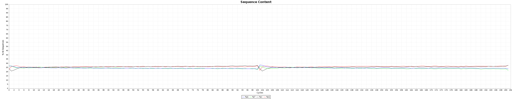
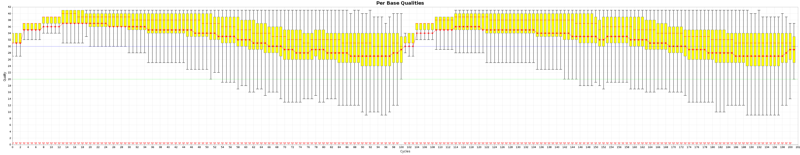

# Module 3

## Lecture

<iframe src="https://drive.google.com/file/d/15hy-fOn7rQHxPEPaXmhNZ-1_N-R_Sfm0/preview" width="640" height="480" allow="autoplay"></iframe>

## Lab

*Created by Mathieu Bourgey, Ph.D*

#### Introduction

This workshop will show you how to launch individual first steps of a DNA-Seq pipeline

We will be working on a 1000 genome sample, NA12878. You can find the whole raw data on the 1000 genome website: [http://www.1000genomes.org/data](https://www.internationalgenome.org/data)

NA12878 is the child of the trio while NA12891 and NA12892 are her parents.

| Mother  | Father  | Child   |
|---------|---------|---------|
| NA12892 | NA12891 | NA12878 |

If you finish early, feel free to perform the same steps on the other two individuals: NA12891 & NA12892.

For practical reasons we subsampled the reads from the sample because running the whole dataset would take way too much time and resources. We’re going to focus on the reads extracted from a 300 kbp stretch of chromosome 1.

| Chromosome | Start    | End      |
|------------|----------|----------|
| 1          | 17704860 | 18004860 |

#### Original Setup

##### Software Requirements

These are all already installed, but here are the original links.

- BVATools
- SAMTools
- BWA
- Genome Analysis ToolKit
- Trimmomatic

#### Environment setup

##### Launching the container

```{}
mkdir -p $HOME/workspace/HTG/Module3/

docker run --privileged -v /tmp:/tmp --network host -it -w $PWD -v $HOME:$HOME \
--user $UID:$GROUPS -v /etc/group:/etc/group  -v /etc/passwd:/etc/passwd \
-v /etc/fonts/:/etc/fonts/ -v /media:/media c3genomics/genpipes:0.8
```

##### Variable Assignment

```{}
export WORK_DIR_M3=$HOME/workspace/HTG/Module3/
export REF=$MUGQIC_INSTALL_HOME/genomes/species/Homo_sapiens.GRCh37/
```

##### Setup

```{}
mkdir -p $WORK_DIR_M3
cd $WORK_DIR_M3
ln -s $HOME/CourseData/HTG_data/Module3/* .
```

##### Modules

To verify your environment setup:

```{}
module avail
module list
```

##### Data Files

The initial structure of your folders should look like this:

```{}
ROOT
|-- raw_reads/               # fastqs from the center (down sampled)
    `-- NA12878/             # Child sample directory
    `-- NA12891/             # Father sample directory
    `-- NA12892/             # Mother sample directory
`-- scripts/                 # command lines scripts
`-- saved_results/           # precomputed final files
`-- adapters.fa              # fasta file containing the adapter used for sequencing`
```

##### Cheat Sheets

- [Unix command line cheat sheet]()
- [Commands file of this module](https://github.com/mbourgey/CBW_HTseq_module3/blob/master/scripts/commands.sh)

#### First Data Glance

So you've just recieved an email saying that your data is ready for download from the sequencing center of your choice.

**1. What should you do?**
  <details>
      <summary>Solution (click here)</summary>
      
      The first thing to do is to download it.
  
      The second thing is making sure it is of good quality.
    
    </details>
  
##### FASTQ Files

Let's first explore the FASTQ file.

Try these commands.

```{}
less -S raw_reads/NA12878/NA12878_CBW_chr1_R1.fastq.gz
```

These are FASTQ files.

**1. Could you describe the FASTQ format?**
  <details>
      <summary>Solution (click here)</summary>
      
      There is four lines for each read:
      
```{}
- Header 1
- DNA sequence
- Header 2
- Quality values
```
  </details>

```{}
zcat raw_reads/NA12878/NA12878_CBW_chr1_R1.fastq.gz | head -n4
zcat raw_reads/NA12878/NA12878_CBW_chr1_R2.fastq.gz | head -n4
```

**2. What was special about the output and why was it like like?**
  <details>
      <summary>Solution (click here)</summary>
      
      It's the same header with a /1 or /2 towards the end. Meaning these are paired data.
  
  </details>
  
You could also count the reads.

```{}
zgrep -c "^@SN1114" raw_reads/NA12878/NA12878_CBW_chr1_R1.fastq.gz
```

We found 56512 reads.

**3. Why shouldn't you just do?**

```{}
zgrep -c "^@" raw_reads/NA12878/NA12878_CBW_chr1_R1.fastq.gz
```
  
  <details>
      <summary>Solution (click here)</summary>
      
      Because the ASCII quality character has @ as a valid value. If the quality line starts with this character you'll count it as a read.

      By this method 82325 counts are found!
  
  </details>
  
##### Quality

We can’t look at all the reads. Especially when working with whole genome 30x data. You could easilly have Billions of reads.

Tools like `FastQC` and `BVATools readsqc` can be used to plot many metrics from these data sets.

Let’s look at the data:

```{}
mkdir -p originalQC/NA12878/
java -Xmx1G -jar ${BVATOOLS_JAR} readsqc \
  --read1 raw_reads/NA12878/NA12878_CBW_chr1_R1.fastq.gz \
  --read2 raw_reads/NA12878/NA12878_CBW_chr1_R2.fastq.gz \
  --threads 2 --regionName ACTL8 --output originalQC/NA12878/
```

Open the images

**1. What stands out in the graphs?**
  <details>
      <summary>Solution (click here)</summary>
      
      Of the raw data we see that:
      
      - Some reads have 3' ends.
  
  </details>

All the generated graphics have their uses. This being said, 2 of them are particularly useful to get an overal picture of how good or bad a run went.

These are the Quality box plots


and the nucleotide content graphs.



The Box plot shows the quality distribution of your data. The Graph goes > 100 because both ends are appended one after the other.

The quality of a base is computated using the Phread quality score.


The formula outputs an integer that is encoded using an [ASCII](https://en.wikipedia.org/wiki/ASCII) table.


The way the lookup is done is by taking the the phred score adding 33 and using this number as a lookup in the table. The Wikipedia entry for the [FASTQ format](https://en.wikipedia.org/wiki/FASTQ_format) has a summary of the varying values.

Older illumina runs were using phred+64 instead of phred+33 to encode their fastq files.

##### Trimming

After this careful analysis of the raw data we see that

- Some reads have bad 3’ ends.
- No read has adapter sequences in it.

Although nowadays this doesn’t happen often, it does still happen. In some cases, miRNA, it is expected to have adapters. Since they are not part of the genome of interest they should be removed if enough reads have them.

To be able to remove adapters and low qualtity bases, we will use Trimmomatic.

The adapter file is already in your reference folder.

We can look at the adapters

```{}
cat adapters.fa
```

**1. Why are there 2 different ones?**
  <details>
      <summary>Solution (click here)</summary>
  
      Because both ends of the fragment don't have the same adapter.
  
  </details>

Let’s try removing them and see what happens.

```{}
mkdir -p reads/NA12878/

java -Xmx2G -cp $TRIMMOMATIC_JAR org.usadellab.trimmomatic.TrimmomaticPE -threads 2 -phred33 \
  raw_reads/NA12878/NA12878_CBW_chr1_R1.fastq.gz \
  raw_reads/NA12878/NA12878_CBW_chr1_R2.fastq.gz \
  reads/NA12878/NA12878_CBW_chr1_R1.t20l32.fastq.gz \
  reads/NA12878/NA12878_CBW_chr1_S1.t20l32.fastq.gz \
  reads/NA12878/NA12878_CBW_chr1_R2.t20l32.fastq.gz \
  reads/NA12878/NA12878_CBW_chr1_S2.t20l32.fastq.gz \
  ILLUMINACLIP:adapters.fa:2:30:15 TRAILING:20 MINLEN:32 \
  2> reads/NA12878/NA12878.trim.out

cat reads/NA12878/NA12878.trim.out
```

**2. What does Trimmomatic says it did?**
  <details>
      <summary>Solution (click here)</summary>
  
      Of the 56512 input pairs:

      - 99.92% were kept
      - 0.06% had only a valid read1
      - 0.02% had only a valid read2
      - None were fully discarded
  
  </details>

Let’s look at the graphs now

```{}
mkdir -p postTrimQC/
java -Xmx1G -jar ${BVATOOLS_JAR} readsqc \
  --read1 reads/NA12878/NA12878_CBW_chr1_R1.t20l32.fastq.gz \
  --read2 reads/NA12878/NA12878_CBW_chr1_R2.t20l32.fastq.gz \
  --threads 2 --regionName ACTL8 --output postTrimQC/
```

** 3. How does it look now?**
  <details>
      <summary>Solution (click here)</summary>
  
      It looks better, but there is still some medium-low quality bases that remain.
  
  </details>

** 4. Could we have done a better job?**
  <details>
      <summary>Solution (click here)</summary>
  
      A sliding windows approach would have been more efficient in this case but it comes with the cost of losing more reads (92% both survived)
      
      Raw:
      
      
      
      Trailing:
      
      
      
  </details>

##### Alignment

The raw reads are now cleaned up of artefacts we can align the read to the reference.

In case you have multiple readsets or library you should align them separately!

**1. Why should this be done separately?** solution

```{}
mkdir -p alignment/NA12878/

bwa mem -M -t 2 \
  -R '@RG\tID:NA12878\tSM:NA12878\tLB:NA12878\tPU:runNA12878_1\tCN:Broad Institute\tPL:ILLUMINA' \
  $REF/genome/bwa_index/Homo_sapiens.GRCh37.fa \
  reads/NA12878/NA12878_CBW_chr1_R1.t20l32.fastq.gz \
  reads/NA12878/NA12878_CBW_chr1_R2.t20l32.fastq.gz \
  | java -Xmx2G -jar ${GATK_JAR} SortSam \
  -I /dev/stdin \
  -O alignment/NA12878/NA12878.sorted.bam \
  -SO coordinate \
  --CREATE_INDEX true --MAX_RECORDS_IN_RAM 500000
```

**2. Why is it important to set Read Group information?** solution

The details of the fields can be found in the SAM/BAM specifications [Here](https://samtools.github.io/hts-specs/SAMv1.pdf) For most cases, only the sample name, platform unit and library one are important.

**3. Why did we pipe the output of one to the other? Could we have done it differently?** solution

##### Lane Merging (Optional)

In case we generate multiple lane of sequencing or mutliple library. It is not practical to keep the data splited and all the reads should be merge into one massive file.

Since we identified the reads in the BAM with read groups, even after the merging, we can still identify the origin of each read.

##### SAM/BAM
Let’s spend some time to explore bam files.

Try

```{}
samtools view alignment/NA12878/NA12878.sorted.bam | head -n4
```

Here you have examples of alignment results. A full description of the flags can be found in the [SAM specification](https://samtools.github.io/hts-specs/SAMv1.pdf).

Try using [picards explain flag site](https://broadinstitute.github.io/picard/explain-flags.html) to understand what is going on with your reads.

The flag is the 2nd column.

**1. What do the flags of the first 4 reads mean?** solution

Let’s take the 3nd one and find it’s pair.

Try

```{}
samtools view alignment/NA12878/NA12878.sorted.bam | grep "1313:19317:61840"
```

**2. Why did searching one name find both reads?** solution

You can use samtools to filter reads as well.

```{}
# Say you want to count the *un-aligned* reads, you can use
samtools view -c -f4 alignment/NA12878/NA12878.sorted.bam

# Or you want to count the *aligned* reads you, can use
samtools view -c -F4 alignment/NA12878/NA12878.sorted.bam
```

**3. How many reads mapped and unmapped were there?** solution

Another useful bit of information in the SAM is the CIGAR string. It’s the 6th column in the file. This column explains how the alignment was achieved.

- M == base aligns but doesn’t have to be a match. A SNP will have an M even if it disagrees with the reference.
- I == Insertion
- D == Deletion
- S == soft-clips. These are handy to find un removed adapters, viral insertions, etc.

An in depth explanation of the CIGAR can be found [here](https://genome.sph.umich.edu/wiki/SAM) The exact details of the cigar string can be found in the SAM spec as well. Another good site

##### Cleaning up Alignments

We started by cleaning up the raw reads. Now we need to fix and clean some alignments.

###### Indel realignment

The first step for this is to realign around indels and snp dense regions. The Genome Analysis toolkit has a tool for this called IndelRealigner.

It basically runs in 2 steps

1 - Find the targets
2 - Realign them.

```{}
#switch to old GATK 3.8
module unload  mugqic/GenomeAnalysisTK/4.1.0.0
module load mugqic/GenomeAnalysisTK/3.8

java -Xmx2G  -jar ${GATK_JAR} \
  -T RealignerTargetCreator \
  -R $REF/genome/Homo_sapiens.GRCh37.fa \
  -o alignment/NA12878/realign.intervals \
  -I alignment/NA12878/NA12878.sorted.bam \
  -L 1

java -Xmx2G -jar ${GATK_JAR} \
  -T IndelRealigner \
  -R $REF/genome/Homo_sapiens.GRCh37.fa \
  -targetIntervals alignment/NA12878/realign.intervals \
  -o alignment/NA12878/NA12878.realigned.sorted.bam \
  -I alignment/NA12878/NA12878.sorted.bam

#return to GATK 4
module unload mugqic/GenomeAnalysisTK/3.8
module load  mugqic/GenomeAnalysisTK/4.1.0.0
```

**1. How many regions did it think needed cleaning?** solution

###### Mark Duplicates

As the step says, this is to mark duplicate reads.

**2. What are duplicate reads?** solution

**3. What are they caused by?** solution

**4. What are the ways to detect them?** solution

Here we will use the GATK approach:

```{}
java -Xmx2G -jar ${GATK_JAR} MarkDuplicates \
  --REMOVE_DUPLICATES false --CREATE_INDEX true \
  -I alignment/NA12878/NA12878.realigned.sorted.bam \
  -O alignment/NA12878/NA12878.sorted.dup.bam \
  --METRICS_FILE=alignment/NA12878/NA12878.sorted.dup.metrics
```

We can look in the metrics output to see what happened.

```{}
less alignment/NA12878/NA12878.sorted.dup.metrics
```

**5. How many duplicates were there?** solution

This is very low, we expect in general <2%.

Note it computed the metrics for each library.

**6. Why is this important to do it by library and not to combine everything?** solution

###### Recalibration

This is the last BAM cleaning up step.

The goal for this step is to try to recalibrate base quality scores. The vendors tend to inflate the values of the bases in the reads. Also, this step tries to lower the scores of some biased motifs for some technologies.

It runs in 2 steps,

1 - Build covariates based on context and known snp sites
2 - Correct the reads based on these metrics

```{}
java -Xmx2G -jar ${GATK_JAR} BaseRecalibrator \
  -R ${REF}/genome/Homo_sapiens.GRCh37.fa \
  --known-sites  ${REF}/annotations/Homo_sapiens.GRCh37.dbSNP150.vcf.gz \
  -L 1:17704860-18004860 \
  -O alignment/NA12878/NA12878.sorted.dup.recalibration_report.grp \
  -I alignment/NA12878/NA12878.sorted.dup.bam

java -Xmx2G -jar ${GATK_JAR} ApplyBQSR \
  -R ${REF}/genome/Homo_sapiens.GRCh37.fa \
  -bqsr alignment/NA12878/NA12878.sorted.dup.recalibration_report.grp \
  -O alignment/NA12878/NA12878.sorted.dup.recal.bam \
  -I alignment/NA12878/NA12878.sorted.dup.bam
```

##### Extract Metrics

Once your whole bam is generated, it’s always a good thing to check the data again to see if everything makes sense.

###### Compute coverage

If you have data from a capture kit, you should see how well your targets worked.

Both GATK and BVATools have depth of coverage tools. We wrote our own in BVAtools because

- GATK was deprecating theirs
-GATK’s is very slow
- We were missing some output that we wanted from the GATK’s one (GC per interval, valid pairs, etc)

Here we’ll use the GATK one

```{}
#switch to old GATK 3.8
module unload  mugqic/GenomeAnalysisTK/4.1.0.0
module load mugqic/GenomeAnalysisTK/3.8

java  -Xmx2G -jar ${GATK_JAR} \
  -T DepthOfCoverage \
  --omitDepthOutputAtEachBase \
  --summaryCoverageThreshold 10 \
  --summaryCoverageThreshold 25 \
  --summaryCoverageThreshold 50 \
  --summaryCoverageThreshold 100 \
  --start 1 --stop 500 --nBins 499 -dt NONE \
  -R ${REF}/genome/Homo_sapiens.GRCh37.fa \
  -o alignment/NA12878/NA12878.sorted.dup.recal.coverage \
  -I alignment/NA12878/NA12878.sorted.dup.recal.bam \
  -L 1:17700000-18100000

#return to GATK 4
module unload mugqic/GenomeAnalysisTK/3.8
module load  mugqic/GenomeAnalysisTK/4.1.0.0

#### Look at the coverage
less -S alignment/NA12878/NA12878.sorted.dup.recal.coverage.sample_interval_summary
```

Coverage is the expected ~30x.

summaryCoverageThreshold is a usefull function to see if your coverage is uniform. Another way is to compare the mean to the median. If both are almost equal, your coverage is pretty flat. If both are quite different, that means something is wrong in your coverage.

###### Insert Size

```{}
java -Xmx2G -jar ${GATK_JAR} CollectInsertSizeMetrics \
  -R ${REF}/genome/Homo_sapiens.GRCh37.fa \
  -I alignment/NA12878/NA12878.sorted.dup.recal.bam \
  -O alignment/NA12878/NA12878.sorted.dup.recal.metric.insertSize.tsv \
  -H alignment/NA12878/NA12878.sorted.dup.recal.metric.insertSize.histo.pdf \
  --METRIC_ACCUMULATION_LEVEL LIBRARY

#look at the output
less -S alignment/NA12878/NA12878.sorted.dup.recal.metric.insertSize.tsv
```

**1. What is the insert size and the corresponding standard deviation?** solution

**2. Is the insert-size important?** solution

###### Alignment metrics

For the alignment metrics, we used to use `samtools flagstat` but with bwa mem since some reads get broken into pieces, the numbers are a bit confusing. You can try it if you want.

We prefer the GATK way of computing metrics

```{}
java -Xmx2G -jar ${GATK_JAR} CollectAlignmentSummaryMetrics \
  -R ${REF}/genome/Homo_sapiens.GRCh37.fa \
  -I alignment/NA12878/NA12878.sorted.dup.recal.bam \
  -O alignment/NA12878/NA12878.sorted.dup.recal.metric.alignment.tsv \
  --METRIC_ACCUMULATION_LEVEL LIBRARY

#### explore the results

less -S alignment/NA12878/NA12878.sorted.dup.recal.metric.alignment.tsv
```

**3. What is the percent of aligned reads?** solution

##### Investigating the Trio (Optional)

At this point we have aligned and called variants in one individual. However, we actually have FASTQ and BAM files for three family members (mother and father)!

As additional practice, perform the same steps for the other two individuals (her parents): NA12891 and NA12892.

Quit working node Environment

```
exit
```

##### Summary

In this lab, we aligned reads from the sample NA12878 to the reference genome `GRCh37`:

- We became familiar with FASTQ and SAM/BAM formats.
- We checked read QC with BVAtools.
- We trimmed unreliable bases from the read ends using Trimmomatic.
- We aligned the reads to the reference using BWA.
- We sorted the alignments by chromosome position using GATK.
- We realigned short indels using GATK.
- We fixed mate issues using GATK.
- We recalibrate the Base Quality using GATK.
- We generate alignment metrics using GATK.

:::: {.callout type="green" title="Lab Complete!" icon="fas fa-party-horn" center_title="true"}

You’re done Module 3! We hope that you enjoyed the lab and that you continue to enjoy Genome Alignment.

::::


