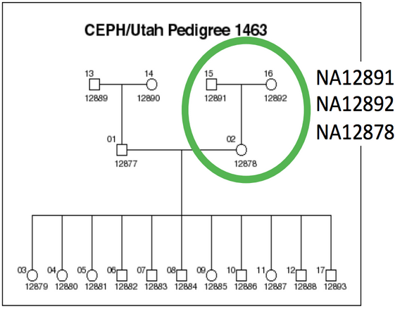
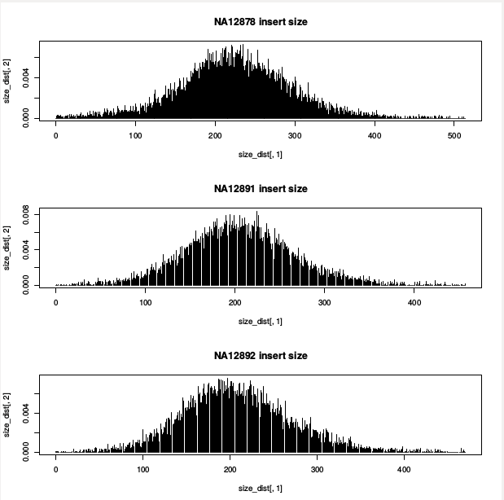
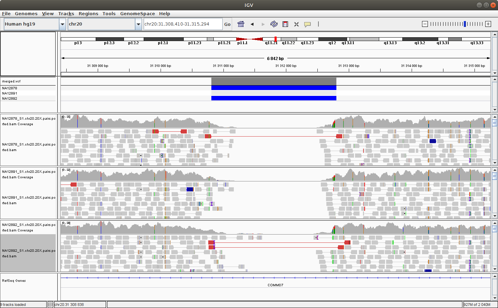

# Module 5: Structural Variant Calling

## Lecture

<iframe src="https://drive.google.com/file/d/1BtuWeWUQHh-r2J1JuT7-ASjOtd9eBHA5/preview" width="640" height="480" allow="autoplay"></iframe>

## Lab

#### Introduction

The goal of this practical session is to identify structural variants (SVs) in a human genome by identifying both discordant paired-end alignments and split-read alignments that.

Discordant paired-end alignments conflict with the alignment patterns that we expect (i.e., concordant alignments) for the DNA library and sequencing technology we have used.

For example, given a ~500bp paired-end Illumina library, we expect pairs to align in F/R orientation and we expect the ends of the pair to align roughly 500bp apart. Pairs that align too far apart suggest a potential deletion in the DNA sample’s genome. As you may have guessed, the trick is how we define what “too far” is — this depends on the fragment size distribution of the data.

Split-read alignments contain SV breakpoints and consequently, then DNA sequences up- and down-stream of the breakpoint align to disjoint locations in the reference genome.

We will be working on a 1000 genome sample, NA12878. You can find the whole raw data on the 1000 genome website: http://www.1000genomes.org/data

The dataset comes from the [Illumina Platinum Genomes Project](http://www.illumina.com/platinumgenomes/), which is a 50X-coverage dataset of the NA12891/NA12892/NA12878 trio. The raw data can be downloaded from the following [URL](http://www.ebi.ac.uk/ena/data/view/ERP001960).

NA12878 is the child of the trio while NA12891 and NA12892 are her parents.



For practical reasons we subsampled the reads from the sample because running the whole dataset would take way too much time and resources. We’re going to focus on the reads extracted from the chromosome 20.

#### Original Setup

##### Software Requirements

These are all already installed, but here are the original links.

* [Manta](https://github.com/Illumina/manta)
* [samtools](http://sourceforge.net/projects/samtools/)
* [bcftools](https://samtools.github.io/bcftools/bcftools.html)
* [BWA-MEM](http://bio-bwa.sourceforge.net/)
* [python](https://www.python.org/)
* [R](https://cran.r-project.org/)

In this session, we will particularly focus on Manta, a SV detection tool. Manta is an integrated structural variant prediction method that can discover, genotype and visualize deletions, tandem duplications, inversions and translocations at single-nucleotide resolution in short-read massively parallel sequencing data. It uses paired-ends and split-reads to sensitively and accurately delineate genomic rearrangements throughout the genome.

If you are interested in Manta, you can read the full manuscript [here](https://doi.org/10.1093/bioinformatics/btv710).

##### Setting up the Workspace

We’ll create a directory in which to do the module 5 lab:
```{}
export WORK_DIR_M5=$HOME/workspace/HTG/Module5
mkdir -p $WORK_DIR_M5
cd $WORK_DIR_M5
```

##### Getting Data

First we’ll download the GRCh38 reference genome. Note that we use brackets to run these commands in a sub-shell so that when they finish, we end up in the same directory as we started.
```{}
(
    mkdir -p ref
    cd ref
    time wget ftp://ftp-trace.ncbi.nih.gov/1000genomes/ftp/technical/reference/GRCh38_reference_genome/GRCh38_full_analysis_set_plus_decoy_hla.fa
    wget ftp://ftp-trace.ncbi.nih.gov/1000genomes/ftp/technical/reference/GRCh38_reference_genome/GRCh38_full_analysis_set_plus_decoy_hla.fa.fai
)
```

Lastly, we’ll download a subset of the bam files. We supply the “chr20” argument to samtools view so that we only download a section of the bam file rather than the whole thing. We do this subsetting in the interests of time so that the subsequent steps proceed more quickly.
```{}
(
    mkdir -p bams
    cd bams
    samtools view \
      -b \
      --reference ../ref/GRCh38_full_analysis_set_plus_decoy_hla.fa \
      ftp://ftp.sra.ebi.ac.uk/vol1/run/ERR323/ERR3239334/NA12878.final.cram chr20 > NA12878.bam
    samtools index NA12878.bam
    samtools view \
      -b \
      --reference ../ref/GRCh38_full_analysis_set_plus_decoy_hla.fa \
      ftp://ftp.sra.ebi.ac.uk/vol1/run/ERR398/ERR3989341/NA12891.final.cram chr20 > NA12891.bam
    samtools index NA12891.bam
    samtools view \
      -b \
      --reference ../ref/GRCh38_full_analysis_set_plus_decoy_hla.fa \
      ftp://ftp.sra.ebi.ac.uk/vol1/run/ERR398/ERR3989342/NA12892.final.cram chr20 > NA12892.bam
    samtools index NA12892.bam
)
```

```{}
$ cd $WORK_DIR_M5
$ tree -h
.
├── [4.0K]  bams
│   ├── [929M]  NA12878.bam
│   ├── [1.3M]  NA12878.final.cram.crai
│   ├── [1012M]  NA12891.bam
│   ├── [1.3M]  NA12891.final.cram.crai
│   ├── [946M]  NA12892.bam
│   └── [1.3M]  NA12892.final.cram.crai
└── [4.0K]  ref
    ├── [3.0G]  GRCh38_full_analysis_set_plus_decoy_hla.fa
    └── [151K]  GRCh38_full_analysis_set_plus_decoy_hla.fa.fai
```

##### Checking the BAMs - MarkedDuplicates

When you are given data, it’s important to understand what it contains. Almost all variant detection protocols strongly recommend that basic QC has been performed, including the marking of duplicates. How would you go about checking that these bam files have already had the “MarkDuplicates” step performed?

Are there any clues in the bam header?

```{}
samtools view -H bams/NA12878.bam | less -S
```

What about in the flags?
```{}
samtools flagstat bams/NA12878.bam
```

##### Checking the BAMs - Fragment size distribution

Before we can attempt to identify structural variants via discordant alignments, we must first characterize the insert size distribution

**What do we mean by “the insert size distribution”?**

:::: {.callout title="Solution (click here)"type="gray" style="subtle" icon="true" collapsible="true"}

The insert size describes the distribution of the size of concordant alignments (i.e., they align in the expected orientation).

::::

**How can we use the fragment size distribution in SV detection?**

:::: {.callout title="Solution (click here)"type="gray" style="subtle" icon="true" collapsible="true"}

We can use the size distribution (mean and standard deviation) to decide the size threshold for discordant alignments.

::::

The following script, taken from LUMPY extracts F/R pairs from a BAM file and computes the mean and stdev of the F/R alignments. It also generates a density plot of the fragment size distribution.

Let’s calculate the fragment distribution for the three dataset:

First, we need some tools from the docker container:
```{}
docker run \
    --privileged \
    -v /tmp:/tmp \
    --network host \
    -it \
    -w $PWD \
    -v $HOME:$HOME \
    --user $UID:$GROUPS \
    -v /etc/group:/etc/group \
    -v /etc/passwd:/etc/passwd \
    -v /etc/fonts/:/etc/fonts/ \
    -v /media:/media \
    c3genomics/genpipes:0.8
```

Now from inside the docker container:

```{}
module load \
    mugqic/LUMPY-SV \
    mugqic/python/2.7.14 \
    mugqic/samblaster/0.1.24 \
    mugqic/sambamba/0.6.6 mugqic/samtools/1.4.1

mkdir -p stats

samtools view bams/NA12878.bam \
| $LUMPY_HOME/scripts/pairend_distro.py \
    -r 101 \
    -X 4 \
    -N 10000 \
    -o stats/NA12878.pairs.histo \
    > stats/NA12878.pairs.params

samtools view bams/NA12891.bam \
| $LUMPY_HOME/scripts/pairend_distro.py \
    -r 101 \
    -X 4 \
    -N 10000 \
    -o stats/NA12891.pairs.histo \
    > stats/NA12891.pairs.params

samtools view bams/NA12892.bam \
| $LUMPY_HOME/scripts/pairend_distro.py \
    -r 101 \
    -X 4 \
    -N 10000 \
    -o stats/NA12892.pairs.histo \
    > stats/NA12892.pairs.params
```

`-r` specifies the read length

`-X` specifies the number of stdevs from mean to extend

`-N` specfies the number of read to sample”

`-o` specifies the output file

Let’s take a peak at the output. First the basic summary:
```{}
cat stats/NA12878.pairs.params
```

… and the first few lines of the histogram file that was produced:

```{}
$ head head stats/NA12878.pairs.histo
0       0.000102082482646
1       0.0
2       0.000204164965292
3       0.000204164965292
4       0.000204164965292
5       0.000306247447938
6       0.000102082482646
7       0.0
8       0.0
9       0.0
```{}

We can now exit the docker container with

```{}
exit
```

Let’s use R to plot the fragment size distribution. First, launch R from the command line.
```{}
# Just to make sure we're in the correct directory:
export WORK_DIR_M5=$HOME/workspace/HTG/Module5
mkdir -p $WORK_DIR_M5
cd $WORK_DIR_M5

# Launch R
R
```

Now, within R, execute the following commands:
```{}
size_dist <- read.table("stats/NA12878.pairs.histo")
pdf(file = "stats/fragment.hist.pdf")
layout(matrix(1:3))
plot(size_dist[,1], size_dist[,2], type='h', main="NA12878 insert size")
size_dist <- read.table('stats/NA12891.pairs.histo')
plot(size_dist[,1], size_dist[,2], type='h', main="NA12891 insert size")
size_dist <- read.table('stats/NA12892.pairs.histo')
plot(size_dist[,1], size_dist[,2], type='h', main="NA12892 insert size")
dev.off()
quit("no")
```

At this point, you should have the following files:
```{}
$ tree stats
stats
├── NA12878.pairs.histo
├── NA12878.pairs.params
├── NA12891.pairs.histo
├── NA12891.pairs.params
├── NA12892.pairs.histo
├── NA12892.pairs.params
└── fragment.hist.pdf
```

Have a look at the resulting PDF plot we generated by using the http server in our instance. Visit http:///HTG/Module5/stats/

**What does the mean fragment size appear to be? Are all 3 graphs the same?**

:::: {.callout title="Solution (click here)"type="gray" style="subtle" icon="true" collapsible="true"}

In each of the 3 samples, the mean is around 200-250 bp


::::

#### SV Detection

##### First call

We’ve used Manta to call SVs on samples one at a time:
```{}
export WORK_DIR_M5=$HOME/workspace/HTG/Module5
mkdir -p $WORK_DIR_M5
cd $WORK_DIR_M5

export MANTA_HOME=/usr/local/manta-1.6.0.centos6_x86_64

# NA12878
${MANTA_HOME}/bin/configManta.py \
--bam bams/NA12878.bam \
--referenceFasta ref/GRCh38_full_analysis_set_plus_decoy_hla.fa \
--runDir singles/NA12878
singles/NA12878/runWorkflow.py --quiet

# NA12891
${MANTA_HOME}/bin/configManta.py \
--bam bams/NA12891.bam \
--referenceFasta ref/GRCh38_full_analysis_set_plus_decoy_hla.fa \
--runDir singles/NA12891
singles/NA12891/runWorkflow.py --quiet

# NA12892
${MANTA_HOME}/bin/configManta.py \
--bam bams/NA12892.bam \
--referenceFasta ref/GRCh38_full_analysis_set_plus_decoy_hla.fa \
--runDir singles/NA12892
singles/NA12892/runWorkflow.py --quiet
```

**How many variants delly found in each sample?**

**How many variants by SV type are found in each sample?**

#### Merge Calls

We need to merge the SV sites into a unified site list:
```{}
bcftools merge \
  --output-type b \
  --output singles/merged.bcf \
  singles/NA12878/results/variants/diploidSV.vcf.gz \
  singles/NA12891/results/variants/diploidSV.vcf.gz \
  singles/NA12892/results/variants/diploidSV.vcf.gz

bcftools index singles/merged.bcf

bcftools view singles/merged.bcf > singles/merged.vcf

bgzip -c singles/merged.vcf > singles/merged.vcf.gz

tabix -fp vcf singles/merged.vcf.gz
```

Look at the output:
```{}
bcftools view singles/merged.vcf.gz | less -S
```

**How many variants by SV type are found?**

#### Re-genotype in all Samples

We need to re-genotype the merged SV site list across all samples. This can be run in parallel for each sample.
```{}
${MANTA_HOME}/bin/configManta.py \
--bam bams/NA12878.bam \
--bam bams/NA12891.bam \
--bam bams/NA12892.bam \
--referenceFasta ref/GRCh38_full_analysis_set_plus_decoy_hla.fa \
--runDir joint/trio

joint/trio/runWorkflow.py --quiet
```

Look at the output:
```{}
bcftools view SVvariants/NA12878.geno.bcf | less -S
```

**Do you know how to look at the resulting file?**

**What might the advantages be to genotyping all members of the trio together?**

#### Setting up IGV for SV Visualization

We can make a second IGV-specific index of the bam files. We need to use a tool (igvtools) from the docker container:
```{}
docker run \
    --privileged \
    -v /tmp:/tmp \
    --network host \
    -it \
    -w $PWD \
    -v $HOME:$HOME \
    --user $UID:$GROUPS \
    -v /etc/group:/etc/group \
    -v /etc/passwd:/etc/passwd \
    -v /etc/fonts/:/etc/fonts/ \
    -v /media:/media \
    c3genomics/genpipes:0.8

module load mugqic/igvtools/2.3.67 mugqic/java

(
  cd ~/workspace/HTG/Module5/bams
  # Iterate over each of the bam files and create an IGV tdf index:
  for bam in *.bam; do
    igvtools count $bam ${bam}.tdf ../ref/GRCh38_full_analysis_set_plus_decoy_hla.fa.fai
  done
)

# Leave the docker container to return to the native shell environment.
exit
```

Launch IGV and load the merged calls and the germline calls using `File -> Load from URL` using:

* http://your.ip.address/HTG/Module5/singles/NA12878/results/variants/diploidSV.vcf.gz
* http://your.ip.address/HTG/Module5/singles/NA12891/results/variants/diploidSV.vcf.gz
* http://your.ip.address/HTG/Module5/singles/NA12892/results/variants/diploidSV.vcf.gz

Now load the bam files in the same way using:

* http://your.ip.address/HTG/Module5/bams/NA12878.bam
* http://your.ip.address/HTG/Module5/bams/NA12891.bam
* http://your.ip.address/HTG/Module5/bams/NA12892.bam

Navigate to the following location to see a deletion: `chr20:32,720,935-32,726,494`

You should see something like this:



You can try to configure IGV such that we can more clearly see the alignments that support the SV prediction.

:::: {.callout type="blue" title="Note"}

Do you remember how to make sure that the alignments are colored by insert size and orientation?

::::

#### Explore the SVs

*Is the variant at chr20:32,720,935-32,726,494 found in each member of the trio?*

:::: {.callout title="Solution (click here)"type="gray" style="subtle" icon="true" collapsible="true"}

The deletion is found in the mother and the daugther but not in the father.

Note the low number of reads supporting the event.

::::

**What are the genotypes for each member of the trio at the locus chr20:63090171-63097143 (e.g., hemizygous, homozygous)?**

:::: {.callout title="Solution (click here)"type="gray" style="subtle" icon="true" collapsible="true"}

The deletion at the position chr20:61,721,523-61,728,495.

| **Sample** |  **ID** |    **genotype**    |
|:----------:|:-------:|:------------------:|
| Mother     | NA12892 | Heterozygous       |
| Father     | NA12891 | Homozigous variant |
| Child      | NA12878 | Homozigous variant |

::::

**What about the variant at chr20:54015643-54047569?**

:::: {.callout title="Solution (click here)"type="gray" style="subtle" icon="true" collapsible="true"}

The deletion at the position chr20:52,632,182-52,664,108

| **Sample** |  **ID** |    **genotype**    |
|:----------:|:-------:|:------------------:|
| Mother     | NA12892 | Homozygous reference       |
| Father     | NA12891 | Heterozygous |
| Child      | NA12878 | Heterozygous |

::::

Now load the Nanopore bam file at:

* http://htg.oicrcbw.ca/Module5/nanopore/nanopore.bam

**Does the evidence in the Nanopore track mimic the evidence in the Illumina track for NA12878?**

:::: {.callout title="Solution (click here)"type="gray" style="subtle" icon="true" collapsible="true"}

What we see from the molleculo data:

* chr20:31,310,769-31,312,959 - yes
* chr20:61,721,523-61,728,495 - yes
* chr20:52,632,182-52,664,108 - yes

This shows how using an orthogonal technology can improve the confidence in the call, particularly if there is low read evidence from a classical Illumina approach.

::::

**What about chr20:18,953,476-18,957,998?**

:::: {.callout title="Solution (click here)"type="gray" style="subtle" icon="true" collapsible="true"}

There are a few reads that show evidence of a deletion in the short read, but no evidence to support that deletion from the molleculo reads. This call is likely a false positive.

::::

Continue exploring the data!

##### Acknowledgements

This module is based on a previous module prepared by Aaron Quinlan and Guillaume Bourque.

:::: {.callout type="green" title="Lab Complete!" icon="fas fa-party-horn" center_title="true"}

You’re done Module 5! We hope that you enjoyed the lab and that you continue to enjoy Single Nucleotide Variant Calling.

::::
